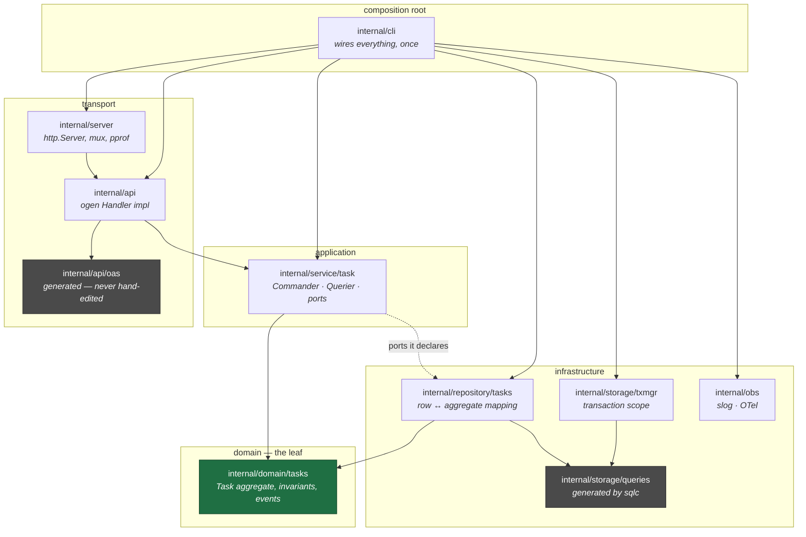
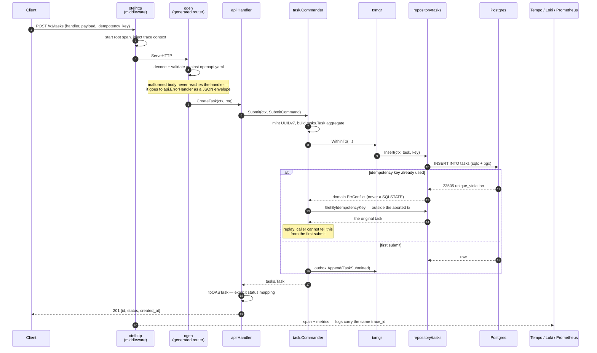
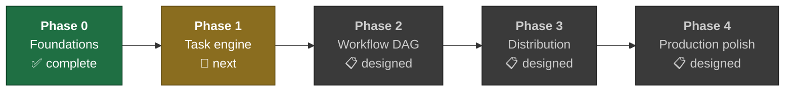

# flowhand

[](https://github.com/RomanAgaltsev/flowhand/actions/workflows/ci.yml)


[](LICENSE)

**A distributed task & workflow orchestration service in Go — built deliberately, in
public, as a learning project.**

> ### Read this first
>
> This is a **learning project**, and the README is written to be honest about that.
> I am building one coherent distributed system instead of a pile of tutorials,
> specifically to close the gaps senior Go backend interviews probe: advanced
> concurrency, distributed coordination, Postgres depth, and production
> observability.
>
> **Phase 0 (Foundations) is complete and runs.** Phases 1–4 are designed in detail
> but **not yet built**. Everything below is split accordingly: [What works
> today](#what-works-today) links to real code you can read; [The road
> ahead](#the-road-ahead) describes what is designed and explicitly does not link to
> code, because there isn't any yet.
>
> If you are evaluating me: the fastest signal is probably
> [Patterns & techniques → where they live](#patterns--techniques--where-they-live),
> which maps each concept to the exact file and line that implements it.

---

## Table of contents

- [What is flowhand](#what-is-flowhand)
- [What works today](#what-works-today)
- [Architecture](#architecture)
- [Patterns & techniques → where they live](#patterns--techniques--where-they-live)
- [Tech stack, and why each choice](#tech-stack-and-why-each-choice)
- [Engineering practices](#engineering-practices)
- [Run it in five minutes](#run-it-in-five-minutes)
- [Repository map](#repository-map)
- [The road ahead](#the-road-ahead)
- [What I have learned so far](#what-i-have-learned-so-far)

---

## What is flowhand

A single Go service that fuses a **task queue** (priorities, retries, cron,
idempotency) with a **declarative workflow DAG engine** (fan-out, fan-in,
conditionals). Think "Celery + Airflow in one binary."

The domain is framed as the backend of a **Stripe-style webhook and notification
delivery platform**: external services POST events, flowhand fans each event out to
its subscriber set, retries on failure, and guarantees each subscriber receives each
event *effectively once*.

That framing is not decoration — it is what makes each hard requirement
*necessary* rather than bolted on:

| The domain demands | So the system needs |
| --- | --- |
| Producers retry webhooks | **Idempotency keys** with a durable floor |
| We promise delivery | **Transactional outbox** — no lost events on crash |
| One event → N subscribers → per-channel transforms | **DAG workflows** |
| Duplicate deliveries break customers | **Effectively-once** end to end |
| Downstream endpoints are fragile | **Rate limiting**, circuit breaking |
| One bad endpoint must not block the queue | **Dead-letter queue** |

Read *task* as "one delivery attempt to one subscriber", and *workflow* as "one
event's fan-out to its subscriber set".

---

## What works today

Phase 0 is a complete, runnable vertical slice: **an HTTP request becomes a row in
Postgres, and you can see the whole thing as a distributed trace in Grafana.**

```bash
task up && task migrate:up && task run:server     # terminal A
curl -X POST localhost:8080/v1/tasks \
  -H 'content-type: application/json' \
  -d '{"handler":"echo","payload":{"msg":"hello"}}'
# → 201 {"id":"019f7013-…","status":"pending","created_at":"…"}
```

| Working today | Where |
| --- | --- |
| `POST /v1/tasks` — OpenAPI-first, generated server, validated input | [`handler.go#L46`](internal/api/handler.go#L46) |
| `GET /v1/tasks/{id}` — 200 / 404 / 500, all typed | [`handler.go#L81`](internal/api/handler.go#L81) |
| **Idempotent submit** — a repeated key replays the original task, never a duplicate | [`commander.go#L54`](internal/service/task/commander.go#L54) |
| Layered architecture, machine-enforced | [`.go-arch-lint.yml`](.go-arch-lint.yml) |
| Distributed tracing HTTP → handler → SQL | [`tracing.go#L15`](internal/obs/tracing.go#L15) |
| Logs carrying `trace_id`, correlated to traces in Grafana | [`log.go#L17`](internal/obs/log.go#L17) |
| Prometheus metrics with SLO-tuned histogram buckets | [`metrics.go#L32`](internal/obs/metrics.go#L32) |
| Graceful shutdown that actually flushes telemetry | [`shutdown.go#L21`](internal/obs/shutdown.go#L21) |
| 12-service dev stack, one command | [`docker-compose.yml`](deploy/compose/docker-compose.yml) |
| Reference load producer that verifies replay on the wire | [`flowhand-demo`](cmd/flowhand-demo/main.go#L124) |

Full walkthrough with expected output at every step:
**[`docs/getting-started.md`](docs/getting-started.md)**.

---

## Architecture

### Layers, and the direction of dependency

The core rule: **dependencies point inward, and the domain depends on nothing.**



`internal/service/task` never names `pgx` or sqlc — it declares the interfaces it
needs in [`ports.go`](internal/service/task/ports.go#L14) and the persistence layer
satisfies them. That inversion is what makes the write path unit-testable with no
database at all, and it is checked by two tools on every commit:
[`.go-arch-lint.yml`](.go-arch-lint.yml) and `depguard` in
[`.golangci.yml`](.golangci.yml). Rules and their traps:
**[`docs/design/architecture/import-rules.md`](docs/design/architecture/import-rules.md)**.

### The lifecycle of one `POST /v1/tasks`



Every arrow in that diagram exists in code today. The pieces worth reading are
linked in the next section.

---

## Patterns & techniques → where they live

This is the map. Each row is a concept I set out to learn, why it is there, and the
exact code that implements it.

### Architecture & design patterns

| Pattern | Why it is here | Implementation |
| --- | --- | --- |
| **Layered architecture** | Dependencies point inward; the domain is a leaf. Enforced, not merely intended. | [`.go-arch-lint.yml`](.go-arch-lint.yml) · [rules](docs/design/architecture/import-rules.md) |
| **DDD-lite: aggregate root** | `Task` has unexported fields, so no code outside the package can build one in an invalid state. | [`task.go#L11`](internal/domain/tasks/task.go#L11) |
| **Bounded contexts** | `tasks` / `workflows` / `schedules` are separate packages that may not import each other — a Phase 2 mistake becomes a lint failure. | [`domain/`](internal/domain) |
| **CQRS-lite** | Writes (`Commander`) and reads (`Querier`) split at the boundary, so Phase 1 can grow transactional writes without touching the read path. | [`commander.go`](internal/service/task/commander.go#L28) · [`querier.go`](internal/service/task/querier.go#L21) |
| **Ports & adapters** | The service declares the interfaces it consumes; persistence implements them. Dependency inversion in ~30 lines. | [`ports.go#L14`](internal/service/task/ports.go#L14) |
| **Three-types pattern** | One "task" wears three shapes — storage row, domain aggregate, transport DTO — so schema changes cannot leak into the API. | [row](internal/storage/queries/models.go) · [domain](internal/domain/tasks/task.go#L11) · [DTO](api/openapi.yaml#L76) |
| **Adapter (GoF)** | Mappers translate at each boundary, so neither type system leaks into the other. | [repo mapper](internal/repository/tasks/mapper.go#L8) · [API mapper](internal/api/mapper.go#L28) |
| **Decorator (GoF)** | A `slog.Handler` wrapping a `slog.Handler` to stamp `trace_id` — same interface in and out, so it composes. | [`log.go#L17`](internal/obs/log.go#L17) |
| **Chain of responsibility** | `otelhttp → ogen → handler`. Phase 1 grows it to auth → rate-limit → idempotency. | [`server.go#L30`](internal/server/server.go#L30) |
| **Composition root** | One place constructs the whole object graph, bottom-up. Nothing else wires anything. | [`cli/server.go#L55`](internal/cli/server.go#L55) |
| **Functional options** | Injected clock and ID generator, so time and UUIDs are deterministic in tests. | [`commander.go#L28`](internal/service/task/commander.go#L28) |

### Distributed-systems mechanics

| Mechanism | The idea | Implementation |
| --- | --- | --- |
| **Idempotency, durable floor** | A partial unique index is the source of truth. Redis will be a *fast path* in front of it, never a replacement — the database is what survives a cache flush. | [migration](migrations/00001_initial_tasks.sql) · [replay](internal/service/task/commander.go#L54) |
| **Replay vs. 409** | A repeated key returns the original task, so a retrying client cannot tell a retry from the first call. | [`commander.go#L76`](internal/service/task/commander.go#L82) |
| **Error translation at the boundary** | `23505` becomes `ErrConflict`, `pgx.ErrNoRows` becomes `ErrNotFound`. No layer above persistence knows SQLSTATE exists. | [`postgres.go#L67`](internal/repository/tasks/postgres.go#L67) |
| **Transaction scope as a port** | The service says "these writes are atomic" without naming `pgx`. Phase 1 swaps the stub for a real `pgx.Tx` in the context — no service code changes. | [`txmgr`](internal/storage/txmgr/manager.go#L33) |
| **Transactional outbox** | State change and its event committed together. The seam exists now; Phase 1 fills it in. | [`outbox`](internal/repository/outbox/outbox.go) |
| **UUIDv7 over UUIDv4** | Time-ordered keys give B-tree locality on insert; v4 scatters writes across the index. | [`commander.go#L55`](internal/service/task/commander.go#L44) |
| **Graceful shutdown** | `signal.NotifyContext` → drain in-flight requests → *then* flush telemetry, on a fresh context because the original is already cancelled. | [`server.go#L60`](internal/server/server.go#L60) · [`shutdown.go#L21`](internal/obs/shutdown.go#L21) |

### Production observability

| Signal | What I did | Implementation |
| --- | --- | --- |
| **Traces** | OTel → OTLP/gRPC → Tempo, with DB spans via `otelpgx`, so one trace spans HTTP and SQL. | [`tracing.go#L15`](internal/obs/tracing.go#L15) · [`pool.go#L14`](internal/storage/pool.go#L14) |
| **Logs ↔ traces** | Every `*Context` log record carries `trace_id`/`span_id`, so Grafana jumps from a span to its log lines. | [`log.go#L21`](internal/obs/log.go#L21) |
| **Metrics** | OTel → Prometheus bridge, with runtime metrics and a shared resource. | [`metrics.go#L17`](internal/obs/metrics.go#L17) |
| **SLO-tuned histograms** | Default buckets top out at 10s — useless against a `p99 < 50ms` SLO. Custom buckets, **pinned by unit**, because otelhttp switched ms → s and a unit-blind View would silently make every SLO look met. | [`metrics.go#L32`](internal/obs/metrics.go#L32) |
| **Continuous profiling** | `pprof` exposed and scraped by Pyroscope, so yesterday's p99 flame graph exists without having predicted you'd want it. | [`server.go#L37`](internal/server/server.go#L37) |
| **Cardinality discipline** | No high-cardinality label ever crosses a histogram; buckets are themselves a cardinality multiplier. | [`metrics.go#L32`](internal/obs/metrics.go#L32) |

### Go language & stdlib depth

| Technique | Implementation |
| --- | --- |
| Custom `slog.Handler` with correct `WithAttrs`/`WithGroup` re-wrapping (the commonly-botched part) | [`log.go#L33`](internal/obs/log.go#L33) |
| Errors as values: sentinels, `%w` wrapping, `errors.Is`/`errors.As` | [`errors.go`](internal/domain/tasks/errors.go) · [`postgres.go#L74`](internal/repository/tasks/postgres.go#L74) |
| `errors.Join` for multi-resource shutdown | [`shutdown.go#L57`](internal/obs/shutdown.go#L57) |
| Interface segregation — the consumer declares the narrow interface it needs | [`handler.go#L23`](internal/api/handler.go#L23) |
| Layered config: defaults → file → env → flags, last wins | [`config.go#L51`](internal/config/config.go#L51) |
| `ReadHeaderTimeout` against slowloris (Go's default is *unlimited*) | [`server.go#L43`](internal/server/server.go#L43) |
| Stdlib-only HTTP — Go 1.22+ `ServeMux`, no gin/echo/chi | [`server.go#L29`](internal/server/server.go#L29) |

---

## Tech stack, and why each choice

Every dependency below was a deliberate decision, not a default.

| Area | Choice | Why this and not the obvious alternative |
| --- | --- | --- |
| **HTTP API** | [ogen](https://github.com/ogen-go/ogen) | OpenAPI-first: the spec is the contract and the server is generated from it, so the two cannot drift. Not gin/echo/chi — stdlib `ServeMux` is enough since Go 1.22. |
| **Database** | [pgx/v5](https://github.com/jackc/pgx) native | Skipping `database/sql` buys real batching, `COPY FROM`, `LISTEN/NOTIFY` and proper Postgres types — all of which Phase 1 needs. |
| **Queries** | [sqlc](https://sqlc.dev) | Write SQL, get type-safe Go. No ORM magic, no `interface{}`, no string interpolation. Not GORM/ent — I want SQL depth, which is half the point of the project. |
| **Migrations** | [goose](https://github.com/pressly/goose) | Plain `.sql` files, usable as a CLI *and* as a library — which is how the [integration tests](internal/repository/tasks/postgres_integration_test.go#L35) migrate a throwaway database. |
| **Config** | [koanf](https://github.com/knadh/koanf) | Composable and test-friendly. Not viper — it couples to cobra and carries global state. |
| **CLI** | [cobra](https://github.com/spf13/cobra) | One binary, many subcommands, matching the process topology. |
| **Logging** | stdlib `log/slog` | Deliberately *not* zap/zerolog/logrus. slog loses some benchmarks; it wins on being the ecosystem default and on `Handler` being trivially decoratable. |
| **Telemetry** | OpenTelemetry | Vendor-neutral. One API, swap the backend. |
| **RPC** | gRPC + [buf](https://buf.build) | Scaffolded now, streaming worker dispatch in Phase 1. buf gives lint and breaking-change detection. |
| **Testing** | testify, testcontainers, native fuzzing, `goleak` | Real Postgres in integration tests beats a mock that agrees with your misconceptions. |
| **Task runner** | [Task](https://taskfile.dev) | Every tool version pinned into `./bin`, and CI runs the *same* targets — so "works locally" and "works in CI" cannot diverge. |

Infrastructure in the dev stack: **Postgres 18**, **Redis 8**, **etcd 3.6**,
**Kafka 4 (KRaft)**, **SeaweedFS** (S3-compatible), and the full
**Grafana LGTM** stack plus **Pyroscope** and **Alertmanager** — twelve services,
one `task up`.

---

## Engineering practices

The habits matter as much as the code.

**Contract tests on the wire** — Handler tests structurally *cannot* see decode
failures, because those never reach a handler method. So the error envelope is
asserted through a real `httptest` server across all six failure classes: malformed
body, validation failure, missing field, bad path param, and handler errors on both
routes. Deleting the error handler turns it red.
→ [`errors_test.go`](internal/api/errors_test.go)

**Fuzzing** — 30 hand-picked adversarial seeds: rune-vs-byte length boundaries
(128 CJK characters = 384 bytes), lone surrogates, RTL overrides, duplicate JSON
keys, `1e309`, 64-deep nesting. The property under test is *if the validator
accepted it, the spec's constraints must actually hold*. Runs nightly in CI.
→ [`validator_test.go`](internal/api/validator_test.go) ·
[`fuzz.yml`](.github/workflows/fuzz.yml)

**Integration tests against real Postgres** — testcontainers spins a throwaway
database and applies the real migrations through the goose library, proving what
unit tests cannot: that a genuine `23505` becomes `ErrConflict`, and that `handler`
actually reaches the column.
→ [`postgres_integration_test.go`](internal/repository/tasks/postgres_integration_test.go)

**Testing call *order*, not just calls** — a shared recorder across all three fakes
asserts `[tx:begin, insert, append, tx:commit]`, and on conflict
`[tx:begin, insert, tx:rollback, get_by_key]` — which pins the subtle decision that
the replay read happens *outside* the aborted transaction.
→ [`commander_test.go#L104`](internal/service/task/commander_test.go#L104)

**Architecture as a CI gate** — two overlapping tools, and the gate is verified to
*fail* on a planted violation. A gate you have never watched fail is one you are
trusting on faith.
→ [`ci.yml`](.github/workflows/ci.yml) ·
[how to verify](docs/design/architecture/import-rules.md)

**Generated code is never hand-edited** — `task gen` regenerates ogen, sqlc and
protobuf. Change the spec, not the output.
→ [`Taskfile.yml`](Taskfile.yml)

**Reproducible tooling** — every tool version is pinned into `./bin`, and CI runs
the *same* `task` targets a developer runs, so "green locally, red in CI" cannot
come from version drift.
→ [`Taskfile.yml`](Taskfile.yml) · [`ci.yml`](.github/workflows/ci.yml)

**Security scanning** — `govulncheck` on every CI run, `gosec` in the linter set.
→ [`ci.yml`](.github/workflows/ci.yml)

**Quality gates on every commit** — all green:
`go build` · `go vet` · `go vet -tags=integration` · `go test -race` ·
`golangci-lint` (16 linters, 0 issues) · `go-arch-lint` · `govulncheck`.

Coverage where it counts: `internal/service/task` **100%**, `internal/api` **98%**.

---

## Run it in five minutes

```bash
task setup        # install every pinned tool into ./bin
task up           # 12-service dev stack
task migrate:up   # apply migrations
task run:server   # terminal A
task demo         # terminal B — reference producer
```

Then open **Grafana at [localhost:3000](http://localhost:3000)** → Explore → Tempo,
and watch a request become a trace with its SQL span and its log lines attached.

Step-by-step with expected output at every stage, plus troubleshooting:
**[`docs/getting-started.md`](docs/getting-started.md)**.

<details>
<summary><b>All Taskfile targets</b></summary>

```sh
task setup          # install every pinned tool into ./bin
task build          # build the flowhand binary
task test           # go test -race ./...
task test:int       # integration tests (testcontainers; requires Docker)
task fuzz           # run every fuzz target (FUZZTIME=30s by default)
task lint           # golangci-lint
task lint:arch      # go-arch-lint — enforce the layered architecture
task vuln           # govulncheck
task gen            # regenerate protobuf + ogen + sqlc
task run:server     # build + run the control-plane server
task migrate:up     # apply database migrations
task migrate:down   # roll back one migration
task demo           # launch the reference producer
task up / down / logs
```

</details>

---

## Repository map

```
flowhand/
├── api/
│   ├── openapi.yaml              # REST contract — source of truth for ogen
│   └── proto/                    # gRPC scaffold (Phase 1)
├── cmd/
│   ├── flowhand/                 # the binary: server|worker|relay|ingester|ctl
│   └── flowhand-demo/            # reference producer, verifies replay on the wire
├── internal/
│   ├── api/                      # transport — ogen Handler, mappers, error envelope
│   │   └── oas/                  # GENERATED by ogen — never hand-edited
│   ├── service/task/             # use cases — Commander, Querier, ports
│   ├── domain/                   # the leaf: aggregates, events, invariants
│   │   ├── tasks/                #   ← the only context with real code today
│   │   ├── workflows/            #   ← Phase 2 placeholder
│   │   └── schedules/            #   ← Phase 1 placeholder
│   ├── repository/               # persistence — row ↔ aggregate, error translation
│   ├── storage/                  # pgx pool, txmgr, sqlc output
│   ├── obs/                      # slog + OTel + shutdown coordination
│   ├── server/                   # http.Server wiring, pprof, /metrics
│   ├── config/                   # koanf loader
│   └── cli/                      # cobra commands — the composition root
├── migrations/                   # goose
├── deploy/compose/               # the 12-service dev stack
└── docs/
    ├── getting-started.md        # five-minute walkthrough
    └── design/architecture/      # import rules and how they are enforced
```

Every package carries a `doc.go` stating its layer and its import rules —
e.g. [`internal/domain/tasks/doc.go`](internal/domain/tasks/doc.go).

---

## The road ahead

Designed in detail, **not yet built**. No code links here, because there is no code
yet — that is the point of keeping this section separate.



### Phase 1 — Single-node task engine 🚧 next

The phase where the queue becomes real. `SELECT … FOR UPDATE SKIP LOCKED` dequeue
with `LISTEN/NOTIFY` wake-up; retries with exponential backoff and jitter; cron
schedules, delayed tasks and priorities; heartbeats with lease extension; a
dead-letter queue for poison messages; the transactional outbox relayed to Kafka;
gRPC streaming dispatch to workers; and the Redis idempotency fast path in front of
the durable floor that already exists.

### Phase 2 — Workflow DAG engine 📋 designed

Topological scheduling with cycle detection; fan-out and exactly-once fan-in under
`SERIALIZABLE` isolation; CEL conditional branches; cascading cancellation;
saga-style compensation on failure; property-based tests over generated DAGs.

### Phase 3 — Distributed coordination 📋 designed

The phase this whole project exists for: etcd leader election with **fencing
tokens** (a stale leader's writes get rejected by a monotonic epoch checked on
every write), consistent-hash sharding with live rebalance touching ≤ 1/N of keys,
active-active sharded schedulers, and chaos drills for leader loss, worker loss and
network partitions.

### Phase 4 — Production polish 📋 designed

Large payloads spilled to S3-compatible object storage; SLOs with burn-rate alerts
and real dashboards; k6 load tests driven to the capacity targets; pprof-guided
optimisation; distroless image and goreleaser.

**Capacity targets** (Phase 4 will measure, not assume): 5,000 tasks/s submit peak ·
2,000 tasks/s sustained execution · p99 submit < 50 ms · p99 end-to-end < 5 s.

---

## What I have learned so far

Phase 0 was supposed to be "just tooling". The lessons that actually stuck were
mostly about **failures that look like success** — and that is the theme I would
most want to talk about in an interview.

- **A gate you have never watched fail is not a gate.** My architecture linter
  config had a schema error that made it exit non-zero *before analysing a single
  import*. It looked configured. It enforced nothing. Now the fix is verified by
  planting a violation and confirming the build breaks
  ([how](docs/design/architecture/import-rules.md)).

- **Silently wrong beats loudly broken — for the *bug*, never for you.** An early
  `GET` handler checked `if err != nil && errors.Is(err, pgx.ErrNoRows)`, so *any
  other* database error fell through to the success path and returned `200` with a
  zero-valued task. A 500 is strictly better than a confident lie.

- **Unit mismatches are invisible.** My latency histogram matched instruments by
  name alone. Then a routine `go mod tidy` moved `otelhttp` past a semantic-convention
  cutover, changing the instrument from milliseconds to **seconds**. Same name,
  same View, every measurement now 1000× off — and the dashboard would have looked
  *better*, with the SLO permanently "met". The selector now
  [pins the unit](internal/obs/metrics.go#L32).

- **Test the seam, not just the sides.** My service layer had 100% coverage handling
  a conflict error — supplied by a fake. Nothing proved the repository actually
  *produced* that error from a real driver. Deleting the SQLSTATE check would have
  kept every test green.
  [Now a real Postgres proves it.](internal/repository/tasks/postgres_integration_test.go)

- **Two type systems meeting is where bugs live.** My domain says `complete`; my
  published API says `succeeded`. An unchecked string conversion compiles fine and
  emits contract violations at runtime. The
  [mapper is explicit](internal/api/mapper.go#L11), with a loud `default` arm.

- **Codegen gives you vocabulary, not implementation.** Declaring `400` and `500` in
  OpenAPI generates the types and nothing else — the default handler still writes
  `text/plain`, so the spec promised JSON the server never sent. Caught only by
  [testing on the wire](internal/api/errors_test.go).

---

## License

[MIT](LICENSE) © 2026 Roman Agaltsev

---

<div align="center">

**Built by Roman Agaltsev** · [GitHub](https://github.com/RomanAgaltsev)

*Questions about any design decision here are very welcome — every one of them has a
reason, and I would enjoy defending or revising it.*

</div>
